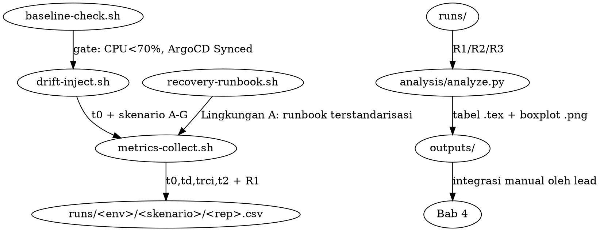

# Experiment Pipeline Design (Bab 4/5 Data Collection)

**Date:** 2026-10-01 | **Approach:** B (Primary + Replication) | **Status:** approved by owner
**Source of truth:** `content/proposal/chapters/bab3-metodologi.tex` (E1–E3, R1–R3, 7 skenario A–G, 4 skrip otomasi)

## Goal

Bangun pipeline eksperimen yang mengeksekusi desain Bab 3 (Evaluasi Empiris Terkontrol:
Lingkungan A manual/`kubectl` vs Lingkungan B GitOps/ArgoCD) dan menghasilkan dataset
(`t0, td, trci, t2` + snapshot R1 + bukti R3) yang siap dianalisis menjadi isi
Bab 4 (Hasil dan Analisis) dan kesimpulan Bab 5.

## Decisions

1. **Workload = surrogate ringan, 2 subjects (opsi B).**
   - S1-primary `exp-s1`: Deployment nginx 3 replika + Service + ConfigMap + Secret + CronJob
     (5 resource; mencakup dimensi stateless + config + secret untuk skenario A–G).
   - S2-replikasi `exp-s2`: S1 + StatefulSet 1 replika + PVC (dimensi stateful).
   - Rasional: full InvenioRDM 16-komponen terlalu berat untuk 105 runs/subject;
     1 subject memenuhi proposal (mono-operation bias sudah diakui di Bab 3),
     subject ke-2 mengubah argumen menjadi replikasi ("pola efek konsisten di 2 titik").
     Fallback: bila S2 gagal, S1 saja tetap memenuhi proposal.
2. **Klaster = Rancher `btd` (default `~/.kube/config`), BUKAN `btd-rke2`.**
   - `btd-rke2` (10.17.104.130) = connection refused (dead).
   - `btd` (10.17.117.178:8443) = reachable, fidelitas vs Bab 3:
     3 node / 24 CPU / ~24 Gi ✅ (spek: 3 node, 24 inti, ~23 Gi),
     k8s v1.32.6+rke2r1 ✅ (spek v1.29+), ArgoCD **v2.12.0** ✅ (spek v2.12+),
     Ubuntu 24.04 ⚠️ (spek 22.04 — deviasi minor, dokumentasikan di Bab 4).
   - PENTING: shell session mewarisi `KUBECONFIG=<Downloads>/btd-rke2.yaml` (dead).
     Setiap agen/pane WAJIB `export KUBECONFIG="$HOME/.kube/config"` lalu verifikasi
     `kubectl config current-context` == `btd` sebelum perintah klaster apa pun.
3. **Namespace terisolasi, tidak pernah menyentuh produksi.**
   `exp-s1-manual`, `exp-s1-gitops`, `exp-s2-manual`, `exp-s2-gitops`.
   Larangan keras: `invenio`, `argocd`, `kube-system`, `default`, `database`,
   `search`, `redis`, `minio`, `monitoring`, `traefik`, `cert-manager`, `velero`.
4. **Dry-run default.** Tidak ada perintah write ke klaster tanpa flag eksplisit
   (`--live`) + namespace dalam daftar izin + `baseline-check.sh` lolos.
5. **Analisis = Python** (pandas/scipy/matplotlib; `R` tidak tersedia):
   deskriptif → Mann-Whitney U (α=0,05) → Cohen's d / Cliff's δ → boxplot + tabel LaTeX.
6. **Mock generator** menghasilkan CSV sintetis berdistribusi realistik agar Bab 4 bisa
   di-draft (tabel/plot sementara) sebelum run klaster selesai; data real menggantikan mock.

## Architecture

## Data schema (`runs/<subject>/<env>/<skenario>/repNN.csv`)

Kolom: `subject,env,skenario,rep,t0,td,trci,t2,r1_t0,r1_t1,r1_t2,kubectl_cmds,notes`.
Waktu dalam epoch-detik (presisi skrip, NTP-synced). R1 = % resource Healthy/Synced.
R3 = bukti terpisah: `trace/<env>/<skenario>/` (git log / audit log excerpt).

## Worker split (no file overlap)

- `exp-harness` → `experiments/scripts/`, `experiments/subjects/`, `experiments/runs/` (sampel dry-run).
  Branch `agent/exp-harness`.
- `exp-analysis` → `experiments/analysis/` (analyze.py, mock generator, requirements, outputs/).
  Branch `agent/exp-analysis`. DILARANG menulis ke klaster (read-only bila perlu).
- Lead menulis `content/skripsi/chapters/bab4-*` / `bab5-*` sendiri saat integrasi.

## Operator decisions (2026-10-02, all confirmed)

1. Q1 shuf: **mandatory** (no fallback) — patch `d5957f2` di `agent/exp-harness`; prereq `coreutils`.
2. Q2 sync interval: **klaster diubah ke 60s** (backup 30s di `/tmp/argocd-cm-backup-20261001.yaml`; verifikasi baca-ulang `60s`; argocd-server tetap Running). Bab 3 tetap benar.
3. Q3 skenario F: **quarantine `<NS>-wrong`** + cleanup runbook — diterima.
4. Q4 nama ArgoCD Application = nama namespace (`exp-s1-gitops`) — dikunci.
5. Q5 trci manual: **tunda ke live wave** — kemudian digantikan keputusan 7.
6. Q6 kuesioner: **digantikan keputusan 7** (lihat di bawah).
7. **OPTION A — manual side fully automated (2026-10-02, approved):**
   - `recovery-runbook.sh` mengeksekusi sendiri DIAGNOSE (describe→logs→events; trci = selesai fase diagnose) lalu CORRECT (kubectl korektif; t2 = baseline re-check pass). Tanpa manusia dalam loop pengukuran.
   - TLX, Likert, profil operator **tidak diperlukan secara prinsip** (bukan di-drop); mitigasi single-operator bias digantikan otomasi penuh.
   - Argumen konservatif: manual diukur pada imperatif-terotomasi tercepat → keunggulan GitOps atas manusia hanya lebih besar dari yang dilaporkan.
   - **Pending wave berikutnya (teks, bukan apparatus):** revisi Bab 3 § Peran Peneliti + Skrip Otomasi + mitigasi keahlian operator; tambah keterbatasan "manual = prosedur terotomasi ideal, bukan praktik manusia lapangan" di Bab 5. Perlu OK pembimbing. Judul & RQ tidak berubah.

## Risks

- Sync interval ArgoCD klaster mungkin bukan 60 detik (Bab 3) → worker-1 verifikasi read-only,
  dokumentasikan nilai aktual; bila beda, catat sebagai deviasi metodologis.
- 210 runs ≈ 2× waktu S1; mitigasi: S2 boleh `n` separuh sebagai replication check.
- Ubuntu 24.04 vs 22.04: dokumentasikan, tidak mengubah desain.
